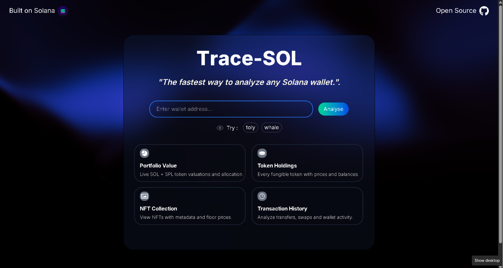

# 🔍 Trace-SOL — Solana Wallet Analyzer

🔗 [Live Demo](https://trace-sol.vercel.app/) · [GitHub](https://github.com/jayant-ssharma/trace-sol)

Paste any Solana wallet address and get a full breakdown of holdings, portfolio value, NFTs, and transaction history in one clean dashboard.

---

## Preview



---

## Features
- 💰 Live SOL balance + USD value via Jupiter Price API
- 🪙 Full SPL token holdings with name, symbol, logo and amount
- 🖼️ NFT gallery — supports regular and compressed NFTs (cNFTs)
- 📜 Up to 30 recent transactions with status and Explorer link
- ⚡ Quick-fill demo buttons on landing page
- 📱 Fully responsive, dark theme

---

## Tech Stack
- Next.js (App Router) · TypeScript · React · Tailwind CSS
- Helius RPC · Jupiter Price API v3
- Next.js API Routes as server-side proxy — API keys never exposed to browser

---

## What I Learned
- Building full-stack apps with Next.js API routes
- Aggregating multiple parallel RPC calls into a single clean response
- Working with real Solana on-chain data (SPL tokens, cNFTs, transactions)
- Handling real-world edge cases like 800+ token wallets and empty accounts

---


This is a [Next.js](https://nextjs.org) project bootstrapped with [`create-next-app`](https://nextjs.org/docs/app/api-reference/cli/create-next-app).

## Getting Started

First, run the development server:

```bash
npm run dev
# or
yarn dev
# or
pnpm dev
# or
bun dev
```

Open [http://localhost:3000](http://localhost:3000) with your browser to see the result.

You can start editing the page by modifying `app/page.tsx`. The page auto-updates as you edit the file.

This project uses [`next/font`](https://nextjs.org/docs/app/building-your-application/optimizing/fonts) to automatically optimize and load [Geist](https://vercel.com/font), a new font family for Vercel.

## Learn More

To learn more about Next.js, take a look at the following resources:

- [Next.js Documentation](https://nextjs.org/docs) - learn about Next.js features and API.
- [Learn Next.js](https://nextjs.org/learn) - an interactive Next.js tutorial.

You can check out [the Next.js GitHub repository](https://github.com/vercel/next.js) - your feedback and contributions are welcome!

## Deploy on Vercel

The easiest way to deploy your Next.js app is to use the [Vercel Platform](https://vercel.com/new?utm_medium=default-template&filter=next.js&utm_source=create-next-app&utm_campaign=create-next-app-readme) from the creators of Next.js.

Check out our [Next.js deployment documentation](https://nextjs.org/docs/app/building-your-application/deploying) for more details.
